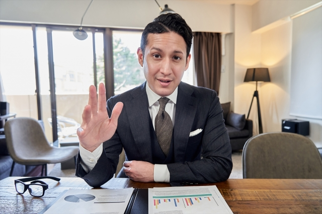

# Webcam-Image-Captioning

A program that generates captions from webcam input images using a pre-trained model.

Generated captions are displayed in real time on the terminal.


# Requirement
* Python >= 3.7

GPU preferred, but works without

# Installation & Usage

```bash
git clone https://github.com/Kitsuya0828/Webcam-Image-Captioning.git
cd Webcam-Image-Captioning
pip install -r requirements.txt
```

## 1. Fast Model
* [PyTorchを活用し画像のキャプションを自動生成するレシピ](https://axross-recipe.com/recipes/114)

Related page : [Image Captioning](https://keras.io/examples/vision/image_captioning/)

```bash
mkdir models

wget https://www.dropbox.com/s/ne0ixz5d58ccbbz/pretrained_model.zip
unzip pretrained_model.zip
mv encoder-5-3000.pkl decoder-5-3000.pkl models

wget https://www.dropbox.com/s/26adb7y9m98uisa/vocap.zip
unzip vocap.zip
mv vocab.pkl models

python main_fast.py
```
### Sample Input


```
=> a man in a suit and tie with a tie
```


## 2. Accurate Model

* [OFA\-Sys/OFA: Official repository of OFA \(ICML 2022\)\. Paper: OFA: Unifying Architectures, Tasks, and Modalities Through a Simple Sequence\-to\-Sequence Learning Framework](https://github.com/OFA-Sys/OFA)

* [caption\_transformers\.ipynb \- Colaboratory](https://colab.research.google.com/drive/1Ho81RBV8jysZ7e0FhsSCk_v938QeDuy3?usp=sharing#scrollTo=xaOphksg3ETI)

* [OFA\-Sys/OFA\-tiny · Hugging Face](https://huggingface.co/OFA-Sys/OFA-tiny)


```bash
git clone --single-branch --branch feature/add_transformers https://github.com/OFA-Sys/OFA.git
pip install OFA/transformers/

git lfs install
git clone https://huggingface.co/OFA-Sys/OFA-tiny

python main_accurate.py
```

### Sample Input


```
=> a man is sitting at a table
```